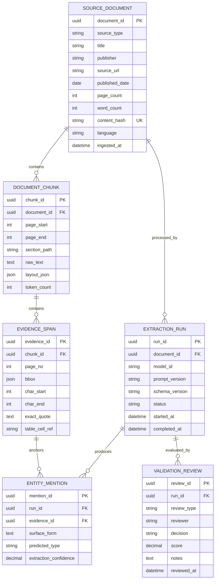
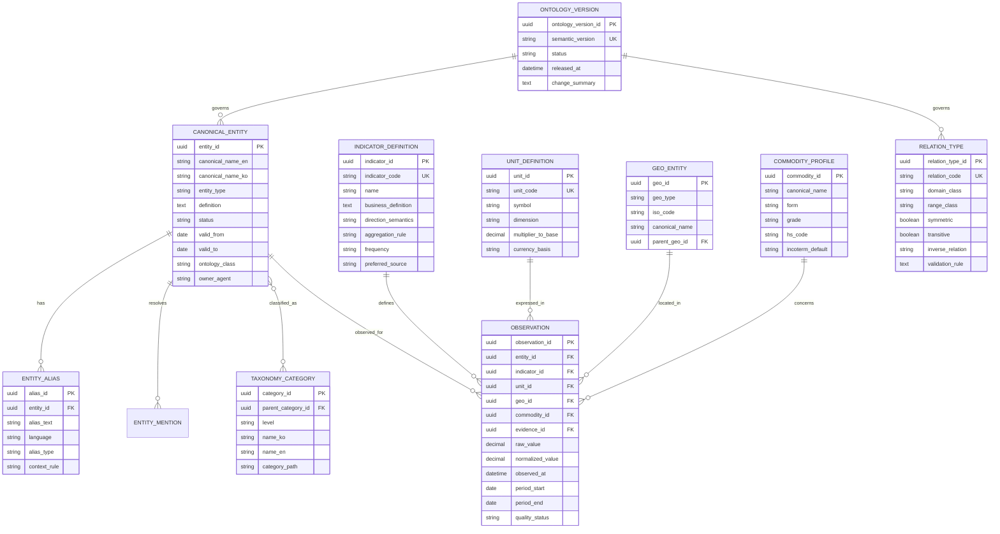
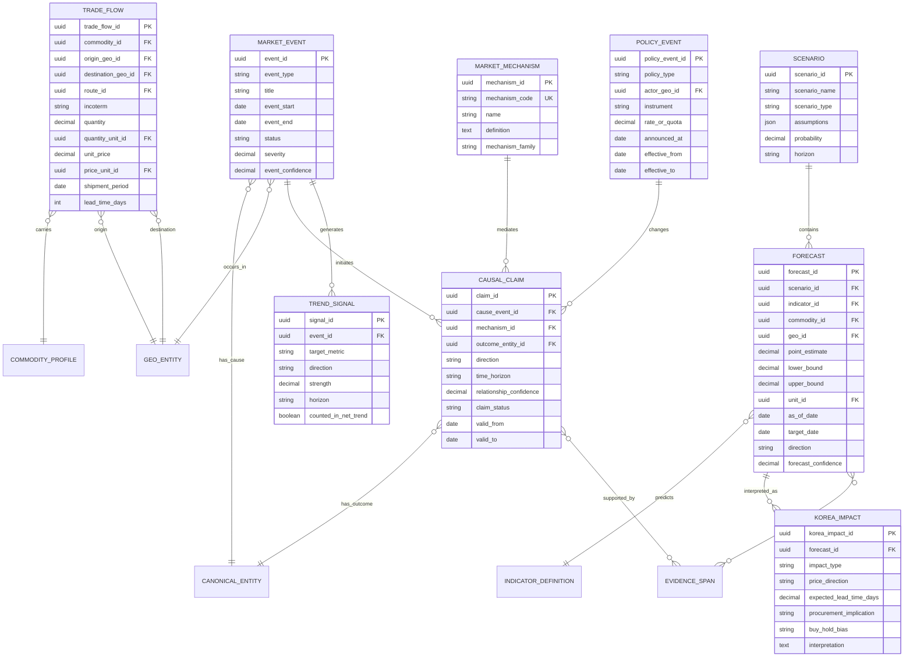

# Project Nexus Semantic Layer & Ontology ERD 설계서 v1.0

작성일: 2026-08-11  
적용 범위: 비정형 문서·PDF 기반 대두유(Soybean Oil) 수급·가격·교역·한국 영향 분석

## 1. 설계 목적

이 설계는 원문 PDF의 문장과 표를 단순 요약하는 데서 끝나지 않고, 각 판단을 **문서 근거 → 표준 용어 → 사건·관측값 → 인과 메커니즘 → 전망 → 한국 영향**으로 추적할 수 있게 만드는 것을 목표로 한다.

Project Nexus의 현재 분석 범위는 대두유 원유·정제유, 미국·브라질·아르헨티나·베트남 원산지, CFR 조건, 약 3개월의 조달 리드타임, Buy/Hold 판단이다. 내부 ERP·S&OP·조달원가는 D-021에 따라 모델 학습·검증·피처에서 제외하고 외부 변수만 사용한다.

> 저장소 정합성 주의: README에는 루트 `AGENTS.md`가 안내되어 있으나 2026-08-11 현재 `main` 브랜치에서 해당 파일을 조회할 수 없었다. 따라서 실제 존재하는 `.claude/skills/phase1/00_phase1_guide.md`, `.claude/agents/*.md`, 기존 요약 Template을 기준으로 설계했다.

## 2. 개념 경계

| 구성요소 | 역할 | 저장 대상 | 하지 않는 일 |
|---|---|---|---|
| Dictionary | 표준 용어와 해석 규칙 | 표준명, 동의어, 분류, 단위, 임계값, 모호성 | 개별 문서의 사실 저장 |
| Semantic Layer | 서로 다른 출처를 같은 비즈니스 의미로 조회 | 표준 엔터티, 지표 정의, 단위, 관측값, 계산 규칙 | 자유로운 관계 추론 자체 |
| Ontology | 어떤 개념과 관계가 허용되는지 정의 | 클래스, 관계형, 도메인·레인지, 제약 | 개별 사건 인스턴스 축적 |
| Knowledge Graph | 온톨로지에 맞는 실제 사실·관계 | 사건, 교역, 정책, 인과 주장, 근거 엣지 | 근거 없는 자동 확정 |

권장 방향은 새로운 거대 온톨로지를 처음부터 만드는 것이 아니라, Project Nexus의 최소 실행 온톨로지(MVO)를 먼저 정의하고 QUDT·SAREF4Agri 등 검증된 어휘와 매핑 가능한 구조를 유지하는 것이다.

## 3. 논리 아키텍처

```text
[PDF·문서·표·뉴스·공식통계]
              │
              ▼
[원문·레이아웃·출처 계층]
 SourceDocument → ExtractionRun → DocumentChunk → EvidenceSpan
              │
              ▼
[정규화·Semantic Layer]
 EntityMention → CanonicalEntity / Alias / Taxonomy
 IndicatorDefinition → Observation ← UnitDefinition
              │
              ▼
[Ontology·Knowledge Graph]
 MarketEvent / PolicyEvent / TradeFlow
 Cause → MarketMechanism → Outcome
              │
              ▼
[분석 제공 계층]
 TrendSignal → Forecast → KoreaImpact → Buy/Hold 근거
```

## 4. ERD-A: 문서·추출·근거 계층



### 핵심 규칙

1. 모든 사건·관계·전망은 최소 하나의 `EVIDENCE_SPAN`과 연결한다.
2. PDF의 페이지, 좌표(`bbox`), 정확 인용문, 표 셀을 보존한다. 페이지 번호만으로 표의 어느 셀인지 알 수 없는 문제를 막는다.
3. `content_hash`로 동일 문서의 중복 수집을 막고, 재추출은 별도 `EXTRACTION_RUN`으로 남긴다.
4. `raw_text`와 정규화 값은 덮어쓰지 않고 함께 보존한다.
5. OCR·레이아웃·표 추출 신뢰도는 엔터티·관계 신뢰도와 분리한다.

## 5. ERD-B: Dictionary·Semantic Layer 계층



### Semantic Layer의 필수 의미 규칙

- **가격 방향의 기준**은 항상 대두유 가격이다. 예: 공급 증가는 경제적 현상으로는 `Supply UP`이지만 가격 신호는 `DOWN`이다.
- `raw_value`, 원단위·통화·기준시점과 `normalized_value`를 함께 보존한다.
- 환율은 `KRW per USD`처럼 분모·분자를 명시하고, CFR/CIF/FOB·원유/정제유·현물/선물의 혼합을 금지한다.
- 관측치가 없으면 `null`로 유지한다. 근거 없는 0 대입이나 보간은 금지한다.
- 임계값은 현재 분석 규칙의 스냅샷이며 영구 진리가 아니다. `valid_from`, `valid_to`, 출처, 버전을 반드시 둔다.
- 신규 용어는 임시 상태로 등록한 후 담당 agent(P1-01~04 또는 P1-06)의 검토를 거쳐 활성화한다.

## 6. ERD-C: 사건·인과·교역·전망 계층



### 인과 관계 제약

허용 경로:

```text
외생 원인(Cause)
  → 시장 메커니즘(Market Mechanism)
  → 수급·비용·가격·리드타임 결과(Outcome)
  → 한국 수입비용·조달시점 영향(Korea Impact)
```

예시:

```text
라니냐
  → 아르헨티나 대두 수율 감소
  → 대두유 공급 감소 및 가격 상승
  → 한국 CFR 수입단가 상승·선구매 압력
```

금지 경로:

```text
라니냐 → 대두유 가격 상승
```

중간 메커니즘과 근거가 없는 직접 인과 엣지는 생성하지 않는다. 상관관계·동시 발생·전문가 해석은 각각 별도 `claim_status`로 구분한다.

## 7. 핵심 엔터티별 최소 필드와 품질 게이트

| 엔터티 | 최소 필드 | 품질 게이트 |
|---|---|---|
| SourceDocument | 제목, 출처, 발행일, 해시, 페이지 수 | 중복 해시 차단, 출처 URL 필수 |
| EvidenceSpan | 문서·페이지·정확 인용·좌표 | 원문으로 역추적 가능해야 함 |
| CanonicalEntity | 한·영 표준명, 유형, 정의, 상태 | 중복·동음이의어 검토 |
| Observation | 지표, 값, 단위, 지역, 시점, 근거 | 단위·시점·품목 일치, 결측 무보간 |
| MarketEvent | 유형, 기간, 지역, 심각도 | 사건과 일반 배경문 구분 |
| CausalClaim | 원인, 메커니즘, 결과, 방향, 근거 | 3단 경로, 근거 필수, 직접 가격 엣지 금지 |
| TradeFlow | 품목, 원산지, 목적지, 조건, 수량/가격 | CFR/CIF/FOB와 기간 명시 |
| Forecast | 기준일, 목표일, 값/방향, 구간, 시나리오 | 과거 관측값과 전망 문장 분리 |
| KoreaImpact | 수입비용, 리드타임, 조달 함의 | 한국 관점의 해석 근거 명시 |
| ValidationReview | 검토 유형, 결과, 점수, 검토자 | 추출·의미·관계·전망 평가 분리 |

## 8. 저장소 YAML과 데이터 모델 매핑

| 현재 자산 | 권장 적재 대상 | 보완 항목 |
|---|---|---|
| `entities.yaml` | `CANONICAL_ENTITY`, `ENTITY_ALIAS`, `GEO_ENTITY`, `COMMODITY_PROFILE` | 유효기간, 상태, 담당 agent |
| `metrics.yaml` | `INDICATOR_DEFINITION`, `UNIT_DEFINITION` | 방향 의미, 집계 규칙, 권장 출처 |
| `ontology.yaml` | `RELATION_TYPE`, `MARKET_MECHANISM`, 클래스 제약 | domain/range, inverse, 금지 관계 |
| `query_templates.yaml` | `QUERY_TEMPLATE` | 필수 슬롯, 출력 스키마, 근거 반환 규칙 |
| 신규 `provenance.yaml/json` | 문서·청크·근거 메타데이터 | 페이지, bbox, 해시, 추출 버전 |
| 신규 `event_schema.json` | 사건·교역·정책·인과·전망 | 시간·지역·근거·신뢰도 필수화 |

운영 데이터는 관계형 DB에 저장하고, 검증된 관계만 그래프 DB 또는 JSON-LD로 투영하는 구성이 안전하다. Dictionary와 온톨로지가 관계형·그래프 양쪽의 공통 계약이 된다.

## 9. Structured Outputs와 평가 경계

OpenAI Structured Outputs는 모델 출력이 지정한 JSON Schema의 모양과 타입을 따르게 하는 데 적합하다. 그러나 스키마 준수는 엔터티가 올바른지, 가격 방향이 맞는지, 페이지 근거가 정확한지를 보장하지 않는다. 따라서 다음 평가 세트를 별도로 둔다.

| 평가 단위 | 대표 지표 |
|---|---|
| 문서 | 페이지 수·단어 수·표 개수 정확도 |
| 엔터티 | 정밀도, 재현율, 동음이의어 오류율 |
| 관계 | 원인–메커니즘–결과 완전성, 관계 방향 정확도 |
| 근거 | 페이지 일치율, exact quote 일치율, 표 셀 일치율 |
| 수치 | 값·단위·통화·기간 정확도 |
| 전망 | 관측/전망 구분, 시계열 누수, 방향·구간 정확도 |
| 한국 영향 | 수입단가·리드타임·조달 함의의 근거 충족률 |

대표 문서에서 사람이 만든 ground truth를 구축하고, 정상·경계·반례를 포함한 eval dataset으로 회귀 평가한다. 동일 문서를 모델·프롬프트·스키마 버전별로 재실행해 차이를 기록한다.

## 10. 구현 우선순위

### Phase 1 — 최소 실행 시맨틱 계층

- Dictionary 152개 용어와 관계 사전을 기준 데이터로 적재
- `SourceDocument`–`EvidenceSpan` provenance 구현
- `CanonicalEntity`·`Alias`·`Taxonomy` 등록
- `Cause → Mechanism → Outcome` 인과 주장과 검토 상태 구현
- PDF 10개로 entity/relation/evidence eval 기준선 수립

### Phase 2 — 시장·교역·전망 통합

- 관측값·단위·환율·기간 정규화
- 무역 흐름, 물류 경로, 정책 사건 통합
- 상승/하락 지표 집계와 중복 신호 제거
- 전망과 한국 영향, Buy/Hold 판단 근거 연결

### Phase 3 — 지식 그래프와 추론

- 검증 완료 인스턴스를 JSON-LD 또는 그래프 DB로 투영
- SHACL 또는 동등한 제약 검증 도입
- 숨은 공급망 의존성, 상충 주장, 시나리오 영향 경로 탐색
- 규칙 기반 추론과 통계·ML 예측을 분리하여 감사 가능성 유지

## 11. 검증용 Competency Questions

1. 현재 대두유 가격의 상승·하락 압력을 만든 외생 원인은 무엇이며, 어떤 시장 메커니즘을 거쳤는가?
2. 각 인과 주장에 대해 원문 문서, 페이지, 정확 인용문을 즉시 반환할 수 있는가?
3. 미국·브라질·아르헨티나·베트남 중 어느 원산지의 공급·운임·정책 신호가 가장 강한가?
4. CFR/FOB, 원유/정제유, 현물/선물, 통화·단위가 섞여 잘못 비교된 값은 없는가?
5. 관측된 사실과 전망, 모델 추론과 전문가 해석이 분리돼 있는가?
6. 한국 도착 원가, 리드타임, 환율 노출, 구매 시점에 미치는 영향은 무엇인가?
7. 서로 상충하는 전망은 무엇이며, 출처·기준일·시나리오 차이로 설명되는가?
8. 내부 ERP·S&OP·조달원가가 모델 피처나 평가 데이터에 유입되지 않았는가?

## 12. 설계 근거

### Project Nexus 저장소

- [Project Nexus README](https://github.com/Jozosco/Nexus/blob/main/README.md)
- [Phase 1 Guide](https://github.com/Jozosco/Nexus/blob/main/.claude/skills/phase1/00_phase1_guide.md)
- [C-04 Document Intelligence Agent](https://github.com/Jozosco/Nexus/blob/main/.claude/agents/c04-document-intelligence.md)
- [C-08 Data Quality Agent](https://github.com/Jozosco/Nexus/blob/main/.claude/agents/c08-data-quality-validator.md)
- [P1-01 Commodity Analyst](https://github.com/Jozosco/Nexus/blob/main/.claude/agents/p101-commodity-analyst.md)
- [P1-02 Geopolitical Risk Analyst](https://github.com/Jozosco/Nexus/blob/main/.claude/agents/p102-geopolitical-analyst.md)
- [P1-03 Climate Intelligence Analyst](https://github.com/Jozosco/Nexus/blob/main/.claude/agents/p103-climate-specialist.md)
- [P1-04 Logistics Analyst](https://github.com/Jozosco/Nexus/blob/main/.claude/agents/p104-supply-chain-analyst.md)
- [P1-05 News Sentiment Analyst](https://github.com/Jozosco/Nexus/blob/main/.claude/agents/p105-news-sentiment.md)
- [P1-06 Semantic & Ontology Engineer](https://github.com/Jozosco/Nexus/blob/main/.claude/agents/p106-semantic-ontology.md)

### OpenAI Developers

- [Structured Outputs](https://developers.openai.com/api/docs/guides/structured-outputs): JSON Schema 기반 구조 준수와 타입 안전성
- [Evaluations](https://developers.openai.com/api/docs/guides/evals): 대표 데이터, ground truth, 평가 기준·grader 기반 검증

### 연구 근거

1. Brewster, C., Kalatzis, N., et al. (2023). “Data sharing in agricultural supply chains: Using semantics to enable sustainable food systems.” *Semantic Web*. 인용 11회. [Consensus record](https://consensus.app/papers/data-sharing-in-agricultural-supply-chains-using-brewster-kalatzis/87d826362228584b84684a25b863237e/?utm_source=chatgpt)
2. Kioukis, A., Papadakis, G., et al. (2025). “Sowing Semantics, Reaping Interoperability: WATSON Ontology Extensions for Extra Virgin Olive Oil Chain Traceability.” *6th International Conference on Electrical, Electronic and Information Engineering*. 인용 0회. [Consensus record](https://consensus.app/papers/sowing-semantics-reaping-interoperability-watson-kioukis-papadakis/51e11d774da15cb4948265ead8802c4b/?utm_source=chatgpt)
3. Kosasih, E. E., Margaroli, F., et al. (2022). “Towards knowledge graph reasoning for supply chain risk management using graph neural networks.” *International Journal of Production Research*, 62. 인용 130회. [Consensus record](https://consensus.app/papers/towards-knowledge-graph-reasoning-for-supply-chain-risk-kosasih-margaroli/c81d54e3233f5496a2eceb1bdb05c631/?utm_source=chatgpt)
4. Wyrembek, M., Baryannis, G., et al. (2024). “Causal machine learning for supply chain risk prediction and intervention planning.” *International Journal of Production Research*, 63. 인용 34회. [Consensus record](https://consensus.app/papers/causal-machine-learning-for-supply-chain-risk-prediction-wyrembek-baryannis/747712947c0f59fe9fe47ea74624e6ba/?utm_source=chatgpt)

## 13. 의사결정 요약

- Dictionary를 단순 용어 목록이 아니라 **표준명·동의어·정의·해석 규칙·방향·단위·임계값·온톨로지 클래스·관계·출처**를 가진 통제어휘로 운영한다.
- Semantic Layer는 수치와 엔터티의 동일 의미를 보장하고, Ontology는 허용 관계와 제약을 보장하며, Knowledge Graph는 검증된 실제 사실을 저장한다.
- 모든 핵심 판단은 문서·페이지·정확 인용으로 역추적 가능해야 한다.
- 외생 원인에서 가격으로 바로 연결하지 않고 반드시 시장 메커니즘을 거친다.
- Structured Outputs는 구조 계약으로 사용하고, 의미 정확성은 별도 eval과 사람 검토로 보장한다.
